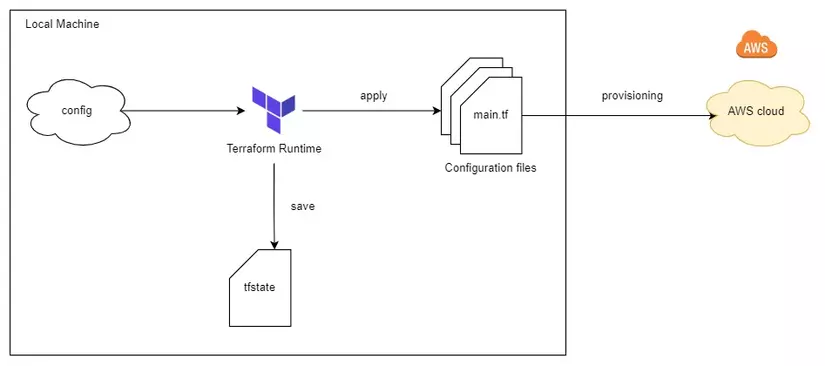
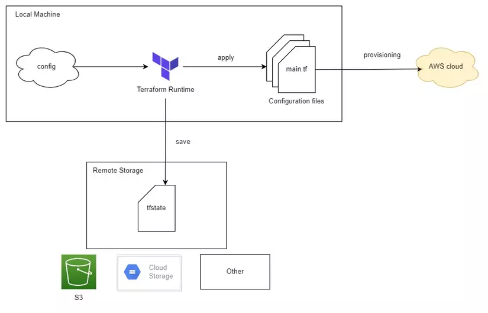
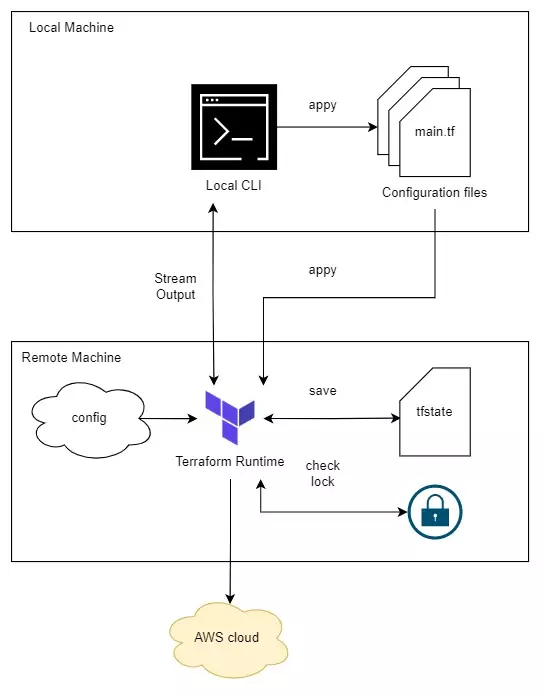

## IaC
- Vấn đề:
  - Khi hạ tầng phình to dẫn đến khó quản lý
  - Khi resource không may bị xóa thì không nhớ config để tạo lại
  - Nếu hạ tầng down thì mất thời gian trong việc tạo lại

## Terraform

- Thay đổi config của resource ngoài terraform
- Terraform functional programing
- khởi tạo workspace: terraform init
- biến trong tf: 
  - locals: lưu giá trị và sử dụng lại nhiều lần
  - khi chạy tf apply thì file .tfvars sẽ được sử dụng mặc định để load giá trị cho biến
  var.tf
  ```
  variable "instance_type" {
  type = string
  description = "Instance type of the EC2"
  }
  ```
  teraform.tfvars
  ```
  instance_type = "t2.micro"
  ```
  - Validating variables
  ```
  variable "instance_type" {
  type = string
  description = "Instance type of the EC2"

    validation {
      condition = contains(["t2.micro", "t3.small"], var.instance_type)
      error_message = "Value not allow."
    }
  }
  ```

- terraform backend
  - local backend
  

  - Standard backend: S3
  

  - Remote backend
   

- some terraform block
  - terraform
  - provider
  - resource: create infra resource on aws
  - data: get aws resource info
  - module
  - variable: declare variable
  - output
  - locals: define constant => local.constant